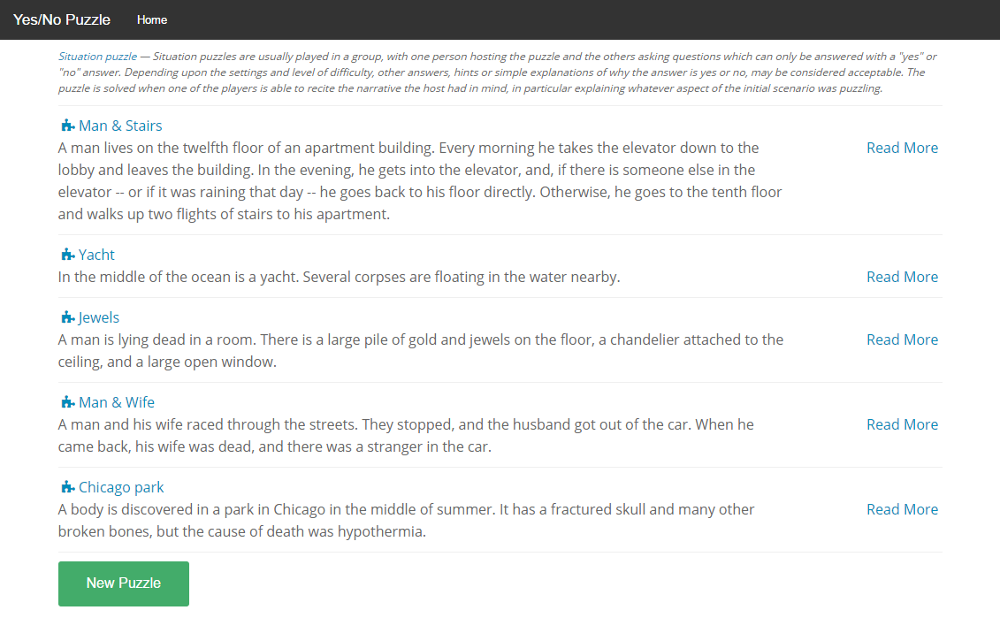

# Yesnopuzzle
Example Ember.js application using ember-cli.

This application is a bit bigger than simple todo apps. I've tried to structure first commits as application development flow. Application uses only frontend approach and emulates server via ember http-mock.

There are several *kinda problems* limited by ~~mocked server capabilities~~ my lazyness.

## Versions
* Ember.js 1.8.0
* Ember Data 1.0.0-beta.11  

## Installation

* `npm install`
* `bower install`

## Running / Development

* `ember serve`
* Visit your app at http://localhost:4200.

## Presentation

* [Presentation Source](https://github.com/RuslanZavacky/yesnopuzzle-presentation)

